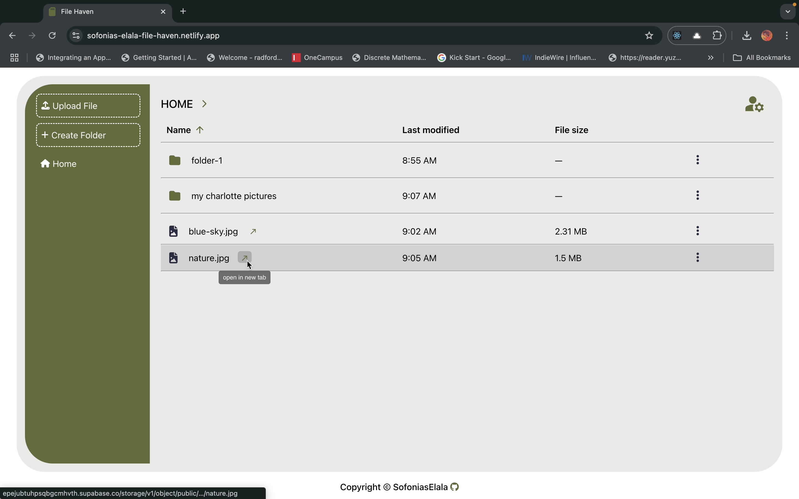
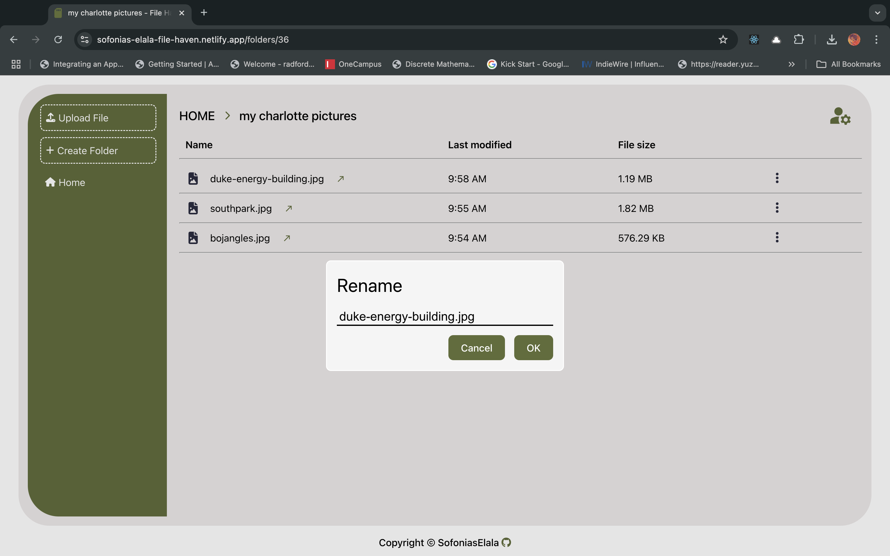
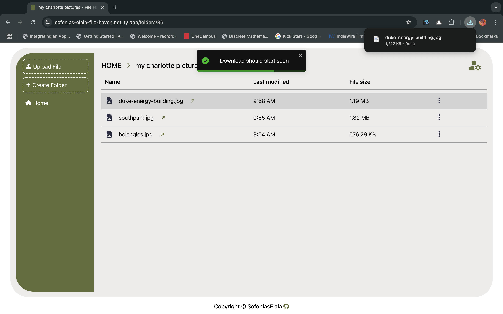

# File Haven

 

## Description
#### ***File Haven*** is a full-stack web application where you can securely store, organize, and manage your personal files and folders. All features require you to create an account, ensuring that your data stays private and tied to your account. Once logged in, you can create folders, upload files, download them, and delete any of your stored items. With its user-friendly interface, File Haven makes managing your files simple and secure.
#### If you don't want to create an account but want to test the features, the login page is pre-filled in with a demo account for you to utilize. all you have to do is click login!

## Link to ***File Haven API*** repo
 * 
 * 

## Potential future features
 * the ability to search for files and folders
 * aria-label for accessability

## Screenshots
#### URL has been changed due to safari not allowing cross domain cookies
 

## Technologies Used:
* REACT + TypeScript + Vite
* HTML5
* CSS3
* version control with Git/GitHub
* Hosting on Netlify

## Dependencies
* REACT + TypeScript + Vite
* React router for client side routing
* Toastify for the toast notifications
* material UI for ToolTips
* eslint